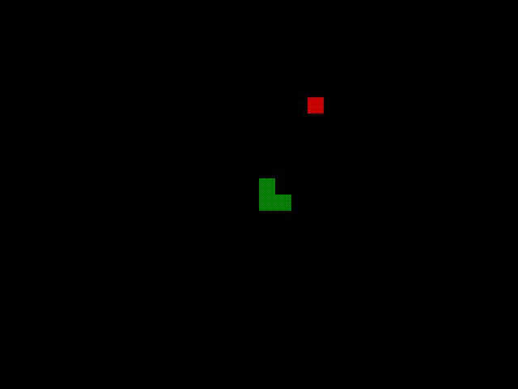
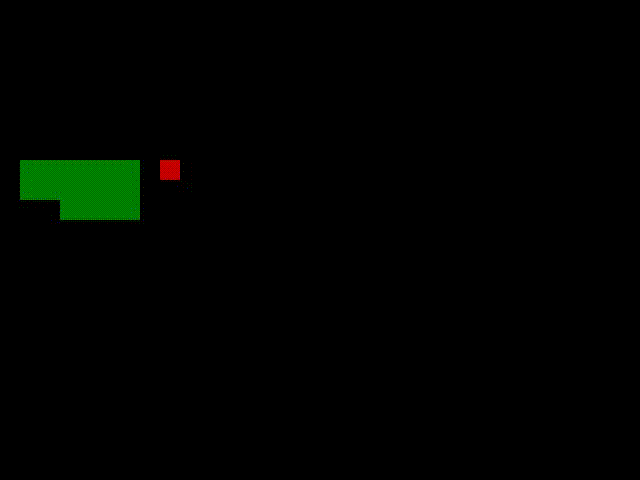
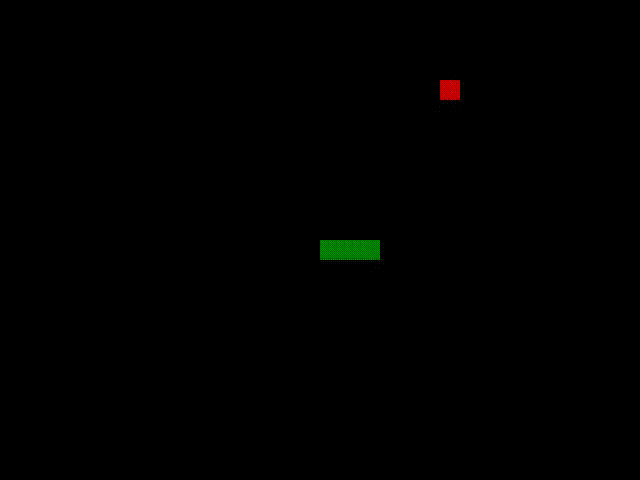

# Snake Agent

A snake game AI agent implementation in Pytorch and Pygame.

## Setup
To install all the dependencies, run following command:
```
pip install -r requirements.txt
```
## Problem

The game state is dependent on:
- position of the snake relative to all the objects that collision with can result in a lost game (itself and walls)
- direction it is taking
- position of the food

Action can have 3 values: 
- [1, 0, 0] - keep going forward in the same direction
- [0, 1, 0] - change direction to right
- [0, 0, 1] - change direction to left

Our goal is to be able to predict at each step (at each game state) an action that will give us maximum possible reward in the end.

## Game rules

The snake is allowed to go in 4 directions: up, left, right and down. 

If snake collides with wall or itself, it is game over. 

If the snake eats food, it's score increases by 1 and the size by one as well.

## Solution

To solve the problem, **Deep Q Learning** approach is used. In this approach, I
 use a neural network to approximate the Q-value function. The state is given as the input and the Q-values of all possible actions are generated as the output of the network. Neural network implementation can be seen in `models.py` file, and the architecture overview on the image below:


Since the state can hold 11 values and actions 3, these are the input and output sizes of the layers in the neural network as well.

General algorithm looks like this:
- initialize q values (initialize model)
- choose an action (with model predict)
- perform this action
- measure the reward
- update q value and train the model

## Training

The training process of the agent can be described in a few steps:
- get current state of the game
- get action from model prediction
- calculate reward and score based on action, see if game is over
- get new state of the game
- train the model on these values

Model improvement in training can be seen below:

After 0 game iterations:



After 100 game iterations:



After 200 game iterations:



## Results

Following picture displays a graph of how score progressed as number of games that agent played increased:


The green line displays how score changed, and the red one how mean score up until that point changed.

We can see that after 120 games model gets significantly better with high score of 68 and has score over 20 consistently. 

The main problem and limitation of the further improvement in score is the size of the snake that takes up 1/10 of total screen area once it eats 68 food, since the size of the screen is 640x480. If screen was larger, model could get better score as well.

### Author: Sava Katic
